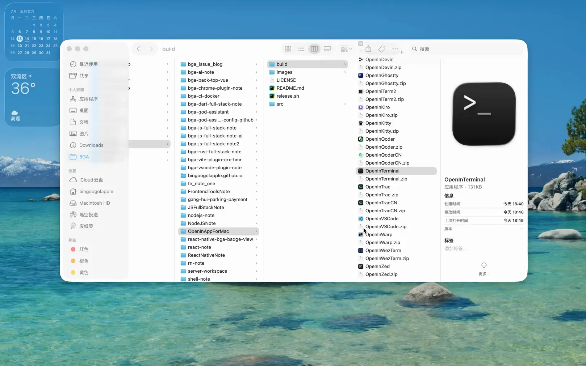

# OpenInAppForMac

[](../../releases/latest)
[](../../actions/workflows/release.yml)
[](LICENSE)
[](../../releases/latest)
[](https://www.apple.com/macos)

**🌐 [English Documentation](README.md)**

基于 AppleScript 的 macOS 小工具集，将当前 Finder 窗口所在目录快速在编辑器中打开，或在终端中打开。

- 编辑器：VSCode、CodeBuddy（含国内版）、Cursor、Devin / Windsurf、Kiro、Qoder（含国内版）、Trae（含国内版）、Antigravity、Zed、CatPaw（员工版 / 公开版）等
- 终端：Terminal、iTerm2、Warp、Ghostty、WezTerm、Kitty 等

> 部分软件会提供独立的「国内版 / 公开版」入口（如 `OpenInCodeBuddyCN`、`OpenInQoderCN`、`OpenInTraeCN`、`OpenInCatPawAI`），以适配不同发行渠道，详见下方的「目录结构」。

## 效果演示



## 软件使用者

如果你只是想用这些小工具，按下面步骤即可，无需关心源码。

### 安装

1. 打开本仓库的 [Releases](../../releases/latest) 页面，在最新版本的 Assets 中下载对应的 OpenInXxx.app 文件并解压到「应用程序」目录。
2. 按住 `command` 键，把解压出来的 `OpenInXxx.app` 拖到 Finder 工具栏。

> 按住 `command` 拖入是为了把应用「固定」到工具栏，而不是移动文件。

> 首次点击工具栏图标若弹出「无法打开，因为无法验证开发者」的提示，这是 macOS Gatekeeper 对未做开发者签名应用的保护。处理方式二选一：右键 app → 打开；或「系统设置 → 隐私与安全性 → 仍要打开」。放行一次后即可正常使用（这些小工具没有开发者签名，属正常现象）。

### 使用

在任意 Finder 窗口中，点击工具栏上的对应图标，即可在该文件夹用对应软件打开。

## 软件维护者

如果你是仓库维护者或想基于源码自行修改、重新导出应用，请往下看。

### 目录结构

```
release.sh                       # 一键把 src/*.scpt 编译为同名 .app 并替换图标
src/                             # 每个软件对应一对同名 .scpt（脚本源码）和 .icns（图标）
  OpenInVSCode.scpt/.icns        # VSCode
  OpenInCodeBuddy.scpt/.icns     # CodeBuddy 国际版
  OpenInCodeBuddyCN.scpt/.icns   # CodeBuddy 国内版
  OpenInCursor.scpt/.icns        # Cursor
  OpenInDevin.scpt/.icns         # Devin/Windsurf
  OpenInTerminal.scpt/.icns      # 系统自带 Terminal.app
  OpenIniTerm2.scpt/.icns        # iTerm2
  OpenInWarp.scpt/.icns          # Warp
  OpenInGhostty.scpt/.icns       # Ghostty
  OpenInWezTerm.scpt/.icns       # WezTerm
  OpenInKitty.scpt/.icns         # Kitty
  OpenInKiro.scpt/.icns          # Kiro
  OpenInQoder.scpt/.icns         # Qoder 国际版
  OpenInQoderCN.scpt/.icns       # Qoder 国内版
  OpenInTrae.scpt/.icns          # Trae 国际版
  OpenInTraeCN.scpt/.icns        # Trae 国内版
  OpenInAntigravity.scpt/.icns   # Google Antigravity
  OpenInZed.scpt/.icns           # Zed
  OpenInCatPaw.scpt/.icns        # CatPaw 员工版
  OpenInCatPawAI.scpt/.icns      # CatPaw 公开版
.github/workflows/
  release.yml                    # 推送 tag 时自动构建并发布 zip 到 GitHub Releases
```

新增软件时，只需在 `src/` 下放入一对同名的 `.scpt` 和 `.icns` 文件，`release.sh` 与 `release.yml` 会自动把全部脚本编译、打包并发布，无需改动构建逻辑。

### 从源码导出为 App

一键导出（推荐）：仓库根目录的 `release.sh` 会自动把 `src/*.scpt` 编译成同名 `.app` 并替换好图标，等价于下面「手动导出」的全部步骤：

```bash
./release.sh
```

脚本所用的 `osacompile` 默认行为正好对应下面这些「不要选」的选项：不显示启动屏幕、执行完即退出（不留驻）、保留源码、不做开发者签名，所以无需任何额外参数。

手动导出（如需逐项目确认）：

1. 右键 `src/OpenInXxx.scpt` → 打开方式 → 脚本编辑器 → 文件 → 导出。
2. 「文件格式」选「应用程序」。
3. 「选项」全部不选：
   - **显示启动屏幕** — 不需要。这只是个瞬时操作，无需启动画面。
   - **运行处理程序后保持打开** — 不需要。脚本执行完（打开 Xxx）即结束，没有需要持续运行的后台任务。
   - **仅运行** — 不勾。保留脚本源码方便以后修改；勾了会剥离源码，文件会小一点但之后无法编辑。
4. 「代码签名」选「不使用代码签名」：
   - 这类工具本地自用，不会发布到 App Store 或分发给他人，无需验证开发者身份或防篡改。
   - 若选了带签名选项却没有对应的 Apple Developer 证书，导出会直接失败，所以「不使用代码签名」最省心。

### 使用方式

- 按住 `command` 键把上一步导出的 `OpenInXxx.app` 拖到 Finder 工具栏；
- 在 Finder 窗口中点击工具栏图标，即可在当前文件夹用对应软件打开。

### 替换应用图标

> 用 `./release.sh` 导出时图标已自动替换好，本小节仅在使用脚本编辑器手动导出、或想换其他图标时才需要。

1. `command + C` 复制对应的 `.icns` 图标文件。
2. 右键 `OpenInXxx.app` → 显示简介。
3. 点击简介面板左上角的小图标（不是底部的预览区）。
4. `command + V` 粘贴，图标立即生效。

### 打包发布

发布通过 GitHub Releases 进行，zip 不再存放在仓库里。流程：

1. 本地跑一次 `./release.sh` 确认能正常生成 `.app` 与 zip（可选，用于自测）。
2. 打一个版本 tag 并推送，例如：

   ```bash
   git tag v1.0.0
   git push origin v1.0.0
   ```

3. 推送后 `.github/workflows/release.yml` 会在 macOS runner 上自动执行 `./release.sh`，
   并把生成的全部 `OpenInXxx.zip`（每个 `.scpt` 对应一个，如 `OpenInVSCode.zip`、`OpenInCursor.zip` 等）上传到该 tag 对应的 Release。

使用者始终从 [Releases](../../releases/latest) 页面下载最新版本，无需在仓库中保留 zip。

## License

本项目基于 [MIT License](LICENSE) 开源，可自由使用、修改与分发。

## 作者联系方式

| 个人主页 | 邮箱 |
| ------------- | ------------ |
| <a  href="https://www.bingoogolapple.cn" target="_blank">bingoogolapple.cn</a>  | <a href="mailto:bingoogolapple@gmail.com" target="_blank">bingoogolapple@gmail.com</a> |

| 个人微信号 | 微信群 | 公众号 |
| ------------ | ------------ | ------------ |
|  |  |  |

| 个人 QQ 号 | QQ 群 |
| ------------ | ------------ |
|  |  |

## 打赏支持作者

如果您觉得 BGA 系列开源库或工具软件帮您节省了大量的开发时间，可以扫描下方的二维码打赏支持。您的支持将鼓励我继续创作，打赏后还可以加我微信免费开通一年 [上帝小助手浏览器扩展/插件开发平台](https://github.com/bingoogolapple/bga-god-assistant-config) 的会员服务

| 微信 | QQ | 支付宝 |
| ------------- | ------------- | ------------- |
|  |  |  |

## 作者项目推荐

* 欢迎您使用我开发的第一个独立开发软件产品 [上帝小助手浏览器扩展/插件开发平台](https://github.com/bingoogolapple/bga-god-assistant-config)